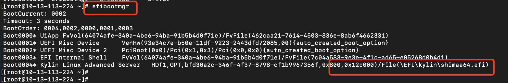

[toc]

# 基于ISO文件制作镜像

基于iso文件制作镜像时，需要依赖于物理机器，对于

## Kylin-v10-arm

## iso启动

```
<disk type='file' device='disk'>
      <driver name='qemu' type='qcow2' cache='directsync' io='native'/>
      <source file='/data/build-image/gpt/kylin-1.img'/>
      <backingStore/>
      <target dev='vda' bus='virtio'/>
      <serial>UCLOUD_DISK_VDA</serial>
      <alias name='virtio-disk0'/>
      <address type='pci' domain='0x0000' bus='0x04' slot='0x00' function='0x0'/>
    </disk>
    <disk type='file' device='cdrom'>
      <driver name='qemu' type='raw'/>
      <source file='/data/build-image/Kylin-Server-V10-SP3-2403-Release-20240426-arm64.iso'/>
      <backingStore/>
      <target dev='vdb' bus='virtio'/>
      <readonly/>
      <alias name='virtio-disk1'/>
      <address type='pci' domain='0x0000' bus='0x05' slot='0x00' function='0x0'/>
    </disk>
```


## cloud-init

```
yum install -y python3-yaml  python3-jsonpatch


OTPROTO=none
DEFROUTE=yes
DEVICE=enp3s0
DNS1=10.13.255.1
DNS2=10.13.255.2
DNS3=114.114.114.114
GATEWAY=10.13.0.1
HWADDR=52:54:00:41:00:9f
IPADDR=10.13.10.24
MTU=1452
NETMASK=255.255.0.0
NM_CONTROLLED=yes
ONBOOT=yes
STARTMODE=auto
TYPE=Ethernet
USERCTL=no


enp3s0: <BROADCAST,MULTICAST,UP,LOWER_UP> mtu 1400 qdisc fq_codel state UP mode DEFAULT group default qlen 1000
    link/ether 52:54:00:a5:56:90 brd ff:ff:ff:ff:ff:ff

```

## 踩坑合集

### 网卡未成功命名

1. 更改grub默认启动项

```
# 首先更改启动项，/etc/default/grub，增加这个配置后，编译并到内核中
GRUB_CMDLINE_LINUX="net.ifnames=0 biosdevname=0 "

grub-mkconfig -o /boot/grub/grub.cfg


# 
```

2. 改了上述之后，发现怎么都不生效，之后发现是uefi启动，且没有走默认的启动项，走的是kylin自己的启动项，因此需要改kylin启动项的配置，才能够初始化网卡name


